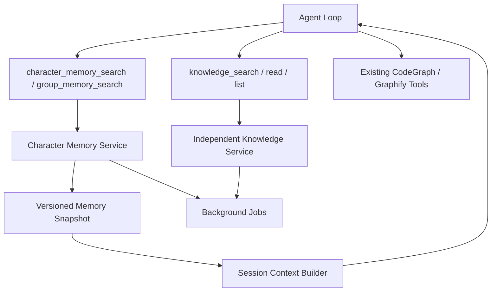

# 天枢角色记忆与独立知识库总体设计

## 1. 已确认的产品方向

1. 优先完整解决每个角色自己的记忆系统。
2. 记忆采用多级结构，并明确触发、修改和遗忘规则。
3. 新会话携带角色记忆，实现跨会话连续性。
4. 同一会话中的 Memory Snapshot 固定，不被过程中新记忆修改，以保持提示词前缀稳定。
5. 组间记忆不默认注入；角色通过工具按需读取其他成员被授权的记忆。
6. 不通过“询问另一个角色”获取记忆，避免额外 Agent 推理和 token。
7. 文件知识库与角色记忆完全分开。
8. CodeGraph 和 Graphify 使用现有能力，不在知识库内重复建设。

## 2. 当前代码现状

- 角色 memory.enabled、charLimit 已有存储/UI，但运行语义不完整。
- 非空 memory.md 可能被整份注入。
- selfEvolution 实际是 Skill 候选逻辑，不是记忆。
- Knowledge 页面目前没有完整上传、转换、分块和检索链路。
- Session Compaction 属于会话恢复，不等于长期角色记忆。

## 3. 领域边界

| 领域 | 事实内容 | 进入 Agent 的方式 |
|---|---|---|
| Conversation / L0 | 当前会话消息和工具结果 | 会话历史 |
| Character Memory | 角色拥有的跨会话事实、偏好、决定、经历 | 固定 Snapshot + 记忆工具 |
| Group Memory Access | 其他角色明确共享的记忆 | group_memory_search 工具 |
| Knowledge Base | 上传文件、Markdown、Chunk、引用 | knowledge 工具 |
| CodeGraph / Graphify | 代码结构、调用图、图谱 | 现有工具 |
| Skill | 可执行方法 | Skill Loadout |
| Goal / Plan | 当前任务状态 | 当前 Run 上下文 |
| Soul / User Note | 人工稳定设定 | 固定系统上下文 |

禁止：

- 将 KnowledgeChunk 写成 MemoryItem。
- 把其他角色记忆默认拼进当前角色 Prompt。
- 把 CodeGraph 结果批量导入知识库。
- 将 Compaction Summary 当作跨会话长期记忆。
- 将 selfEvolution 保留在 Memory 配置中。

## 4. 总体架构

Memory 与 Knowledge 是两个独立 bounded context。可以共享通用 Job、凭据和 Embedding Provider 接口，但拥有各自的 Repository、表、状态机、权限和 UI。

## 5. 角色记忆模型

### 5.1 L0：会话工作记忆

当前 Session 消息、工具结果和 Compaction。只服务当前会话，不直接跨会话注入其他 Session。

### 5.2 L1：原子长期记忆

单个 preference、fact、decision、constraint、event 或 experience。每项有 owner_character、来源、有效期、敏感级别、visibility 和 revision。

### 5.3 L2：主题/情节记忆

将相关 L1 组织成项目摘要、人物关系或时间线。L2 是可重建派生内容，必须指向 L1 证据。

### 5.4 L3：角色 Memory Snapshot

为新会话生成的稳定、紧凑、版本化记忆块。Snapshot 只包含当前有效且无未解决冲突的内容。

## 6. 触发与修改

触发分为：

- 强触发：用户明确记住/忘掉、手工编辑、memory_propose、Compaction 前检查点。
- 批量触发：Session 结束、空闲、未处理消息达到阈值、用户手动整理。
- 弱信号：只决定是否排队，不直接写记忆。

修改操作固定为：

- create。
- reinforce。
- revise：建立新 revision，旧项 superseded。
- conflict：保留双方，不进入稳定 Snapshot。
- forget。
- ignore。

不在每轮都调用提取模型，不无历史地覆盖旧记忆。

## 7. 会话和缓存

创建新 Session 时生成 SessionMemorySnapshot 并绑定 snapshot_id。提示词中的 Snapshot 在该 Session 生命周期内保持字节级稳定。

会话过程中：

- 新记忆可以异步写入记忆库。
- 当前 Session Snapshot 不自动变化。
- 当前对话依靠 Recent Messages 理解新内容。
- 新记忆在下一新 Session 中生效。
- 恢复旧 Session 仍使用旧 snapshot_id。

Snapshot 放在固定系统提示词区域，动态 memory/knowledge 工具输出位于其后。这样可以提高同一会话后续轮次的前缀缓存稳定性。

## 8. 组内记忆

不建设“问另一个角色”的默认路径。

group_memory_search 直接读取其他组成员满足以下条件的记忆：

- visibility=group。
- 当前角色与 owner 位于允许的同一组。
- 当前角色拥有 memory:read_group。
- 记忆 active、未过期、未删除。

工具结果返回 owner、类型、摘要、时间和来源标识，并写访问审计。private 记忆永远不会因为同组自动共享。

## 9. 独立知识库

知识源包含：

- 不可变原文件。
- normalized Markdown。
- 可选 curated Markdown。
- source-map。
- Chunk。
- FTS 和 Embedding 派生索引。

知识库通过 knowledge_search/read/list_sources 使用。角色只有显式 Binding 后才能访问。知识工具结果不进入 Memory Snapshot，也不会自动形成角色记忆。

## 10. CodeGraph 与 Graphify

- 保留现有存储、索引、命令和 Agent 工具。
- 不把代码图谱复制到 Knowledge 表。
- 不用文件知识库重新向量化已由 CodeGraph/Graphify 表达的代码关系。
- 角色 Tool Loadout 可以同时拥有 Knowledge、CodeGraph 和 Graphify 工具。

如果未来需要统一搜索入口，只实现工具路由/结果展示，不合并事实存储。

## 11. 提示词顺序

建议稳定顺序：

    System Rules
    Character Soul
    Character Memory Snapshot
    User Note
    Goal / Plan
    Skill / Tool Guide
    Compaction Summary
    Recent Messages

Character Memory Snapshot 在同一会话内固定。Knowledge、组记忆和长尾角色记忆通过 Tool Message 动态进入，不重写固定前缀。

## 12. 隐私与用户控制

- Memory mode：off、read_only、review、auto。
- 记忆默认 private。
- 敏感内容默认 review 或拒绝自动保存。
- 用户可以查看来源、revision、冲突、访问记录和 Snapshot。
- 删除立即影响 Snapshot 构建和所有检索。
- 无痕 Session 不读不写长期记忆。
- 外部 Embedding 数据发送必须显式启用。

## 13. 数据迁移原则

- 角色记忆一期只迁移到最终 Character Memory Schema 一次。
- 知识库二期直接创建独立最终 Schema。
- 两个领域不要求同时迁移，也不互相兼容。
- memory.md 迁为角色 manual_note，不进入知识库。
- selfEvolution 迁为 skillMining.enabled。
- 开发期不长期双写。

## 14. 全局验收

- 角色 A 的当前会话 Snapshot 保持稳定。
- A 的新会话携带 A 最新已发布记忆。
- B 不能读取 A 的 private 记忆。
- B 可通过工具读取 A 明确共享的 group 记忆，无需启动 A。
- Knowledge 与 Memory 在存储、UI、工具和删除路径上可明确区分。
- CodeGraph/Graphify 保持现有实现。
- 所有记忆和知识命中可追溯、可撤销、可删除。
